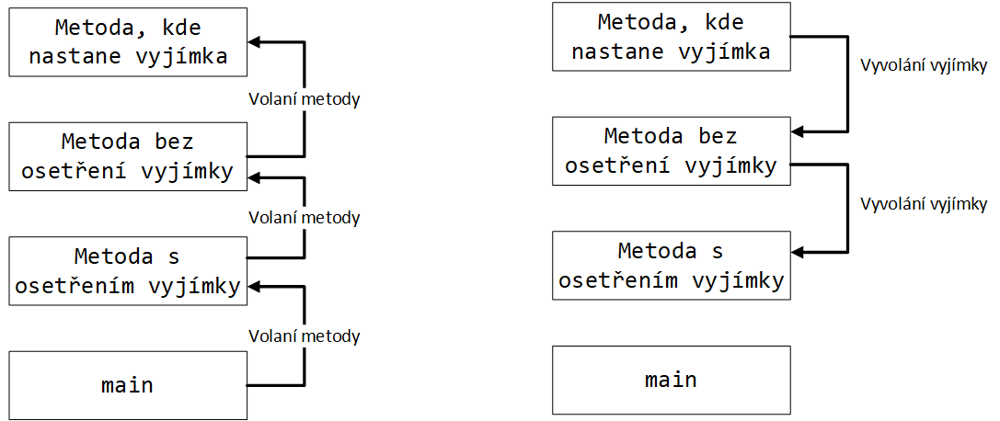

<p align="center">
  
</p>

# Java 2 - 4. lekce

V dnešní lekci si vysvětlíme vyjímky a jejich použítí v Javě. A projdeme si zadání dvou projektů pro kurz Java 2.

## Vyjímky

Tato kapitola navazuje na předchozí části kurzu, kde jsme se seznámili s řízením toku programu pomocí `if-else`, `do-while`, `switch`, `break` a podobné. Dosud jsme v kurzu pracovali jen se situacemi, kdy program buď fungoval správně nebo nefungoval vůbec. Například, když jsme zkoušeli dělit nulou, tak program skončil chybou `ArithmeticException` a vypsal:

```
public class DeleniNulou {
    public static void main(String[] args) {
        int c = 1 / 0;
    }
  }
```

```
Exception in thread "main" java.lang.ArithmeticException: / by zero
    at DeleniNulou.main(DeleniNulou.java:3)
```

Výraz `Exception / Vyjímka` je z výrazu Exceptional event / Výjímečná událost.

Definice: Vyjímka je událost, která nastane pří vykonávání programu a naruší běžný chod programových instrukcí.

Při vývoji software je potřeba počítat i se situacemi, kdy některá volání mohou dopadnou pokaždě různě a v případě chyby je potřeba patřičně zareagovat. Například, když uživatel zkouší uložit data na disk, který právě odpoji nebo pokud zkouší stáhnout data ze serveru, ale spojení je přes nestabilní Wi-Fi. Řídít takovou logiku pomocí větvení je sice možné, ale není to příliš praktické.

Ukázka kódu s výjimkou
```
try {
    //Nejaka operace, kde muze nastav vyjimka
} catch (Exception e){
    e.printStackTrace();
}
```

### Stack volání metod

Ukázka StackTrace při chybě


```
Exception in thread "main" java.lang.NullPointerException
        at com.example.myproject.Book.getTitle(Book.java:16)
        at com.example.myproject.Author.getBookTitles(Author.java:25)
        at com.example.myproject.Start.main(Start.java:14)
```

```
class ThrowException{
  public void run() throws Exception{
    System.out.println("ThrowException");
    throw new Exception("Chyba");
  }
}
class WithoutExceptionHandler{
  public void run() throws Exception{
    System.out.println("WithoutExceptionHandler");
    ThrowException t = new ThrowException();
    t.run();
  }
}
class WithExceptionHandler{
  public void run() {
    System.out.println("WithExceptionHandler");
    WithoutExceptionHandler wo = new WithoutExceptionHandler();
    try{
      wo.run();
    }catch(Exception e){
      System.out.println("Exception:"+e);
    }
  }
}
class Main {
  public static void main(String[] args) {
    System.out.println("main");
    WithExceptionHandler wi = new WithExceptionHandler();
    wi.run();
  }
}
```

```
java -classpath .:/run_dir/junit-4.12.jar:target/dependency/* Main
main
WithExceptionHandler
WithoutExceptionHandler
ThrowException
Exception:java.lang.Exception: Chyba
```

### Použití výjimek

#### Diagram hierarchie vyjimek v JDK


### Základní typy Excepetions v JDK

Rozdíl mezi Checked, Unchecked výjimkami a Error

V Javě jsou definováné dva různé typy vyjímek a jejich chování. Checked (hlídané), u kterých je potřeba definovat chování explicitně v programu a kompilátor to kontroluje. Unchecked (nehlídané nebo běhové) vyjímky jsou potomky tříd java.lang.Error nebo java.lang.RuntimeException a takové vyjímky není nutné definovat v programu. Je možné je odchytit, ale často jde o takové chyby, kde už není možné a ani žádoucí v běhu programu pokračovat, např java.lang.OutOfMemoryError. Pokud taková chyba nastane tak je často potřebat změnit logiku programu (použít jiný algoritmus), změnit nastavení (alokovat více paměti pro JVM) nebo program přesunout na systém s více paměti


### Použití výjimek

Vyjímka má několik částí

try - klíčové slovo na začátku bloku
try (definice AutoCloseable zdroje) - volitelný blok pro definici zdrojů, které budou automaticky uzavřené a není nutné je uzavírat ve finally bloku
try {} - hlavní blok kódu, který miže vyvolat vyjímku
catch (definice vyjímky) - definice typu vyjímky k ošetření
catch (..) {ošetření vyjímky} - blok kódu na ošetření vyjímky
finally {} - blok kódu, který se provede v každém případě
Try-Catch
```
try {
   statements-1
}
catch ( exception-class-name  variable-name ) {
   statements-2
}
```
Multi-catch blok
```
try {
   statements-1
}
catch ( exception-class-name  variable-name ) {
   statements-2
} catch (other-exception-class-name variable-name) {
    statements-3
}
```
Je možné seskupit definici vyjímek dohromady

```
try {
   statements-1
}
catch ( exception-class-name | other-exception-class-name  variable-name ) {
   statements-2
} catch (another-exception-class-name variable-name) {
    statements-3
}
```
Try-Catch-Finally
```
try {
   statements-1
}
catch ( exception-class-name  variable-name ) {
   statements-2
} finally {
    statements-3
}
```
Try-with-resources
Specialní konstukt v Javě značně zjednodušuje práci se I/O je try-with-resources. Tento konstrukt umožní vytvořit instance objektů java.lang.AutoCloseable bez potřeby definovat jejich uzavření. Práce se soubory je tímto mnohem jednodušší a je možné vyvarovat se chyb, kde soubory jsou programem uzamčené až do ukončení běhu programu. Více detailů si ukážeme v další kapitole vysvětljující práci s I/O.

```
try (create-autocloseable-resources-statements) {
    statements-1
} catch(SomeOtherException ex) {
    statements-2
}
```

### Časté příklady výjimek

#### NullPointerException (NPE)

Jedna z velice častých chyb je přístup na metody objektu, který není inicializovaný. Např chybějící konfigurace, nezadaná hodnota od uživatele nebo špatně strukturovaný kód, porovnání pomocí equals(...) nebo volání toString()

```
String valueA;
String valueB;
// CHYBA - Zde nastavane NullPointer Exception
if (valueA.equals(valueB)){
    //
}
```

Do verze JDK 14

```
Exception in thread "main" java.lang.NullPointerException
    at MyClass.main(MyClass.java:8)
```
Od verze JDK 14
```
Exception in thread "main" java.lang.NullPointerException: Cannot invoke "java.lang.Long.equals(Object)" because "<local1>" is null
    at Main.main(Main.java:8)
```
